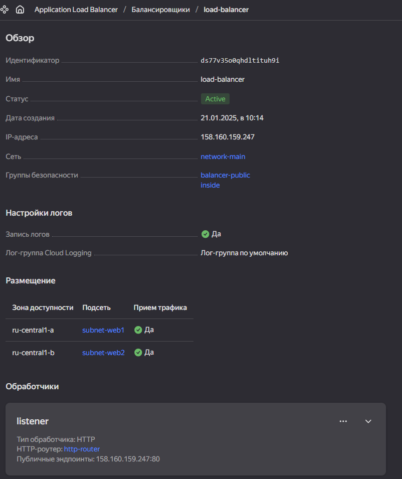
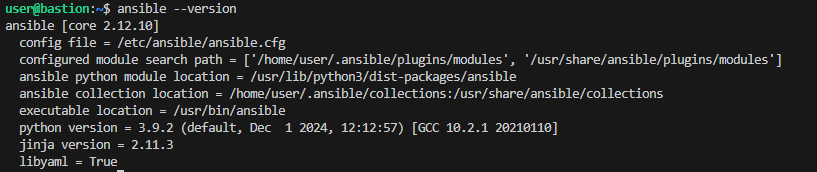
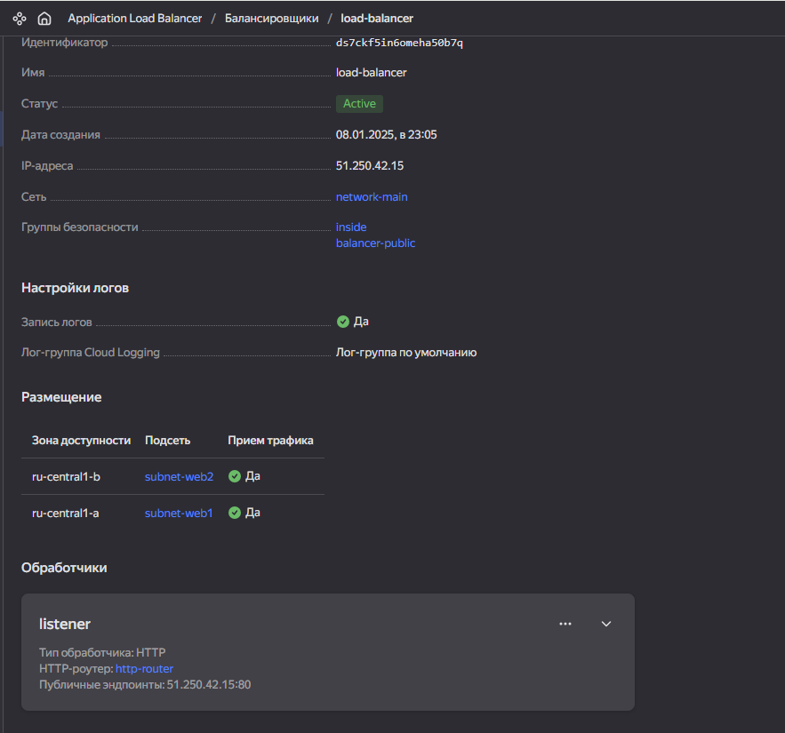
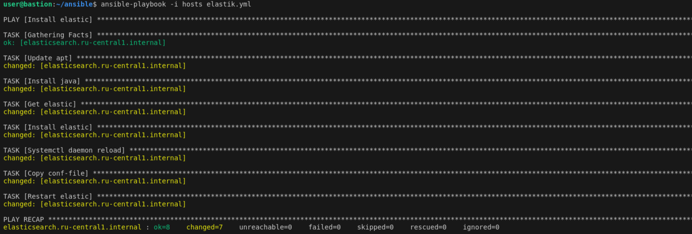
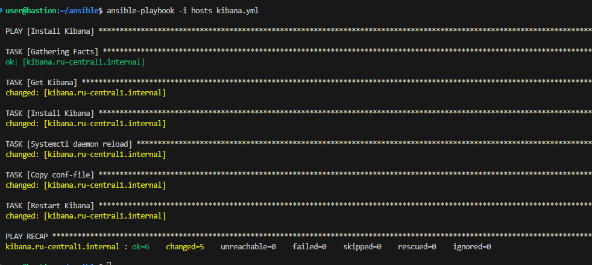
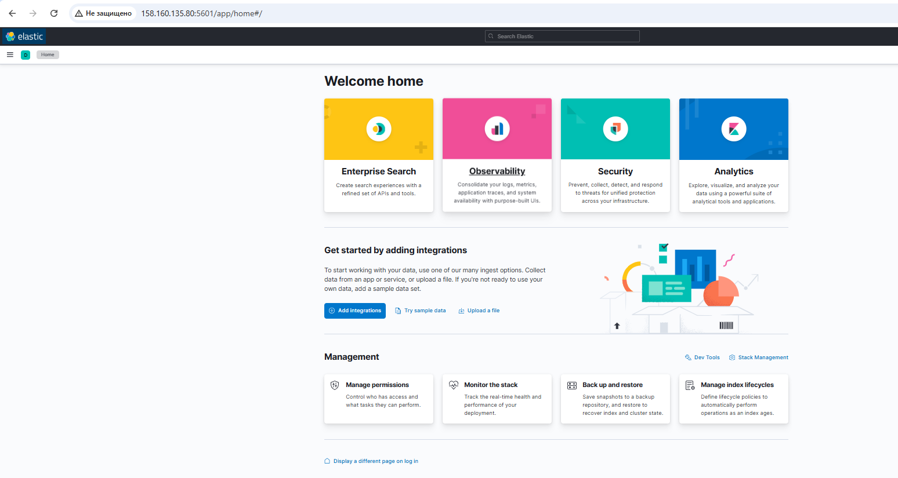
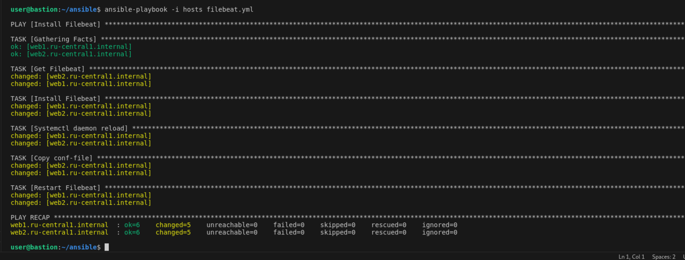
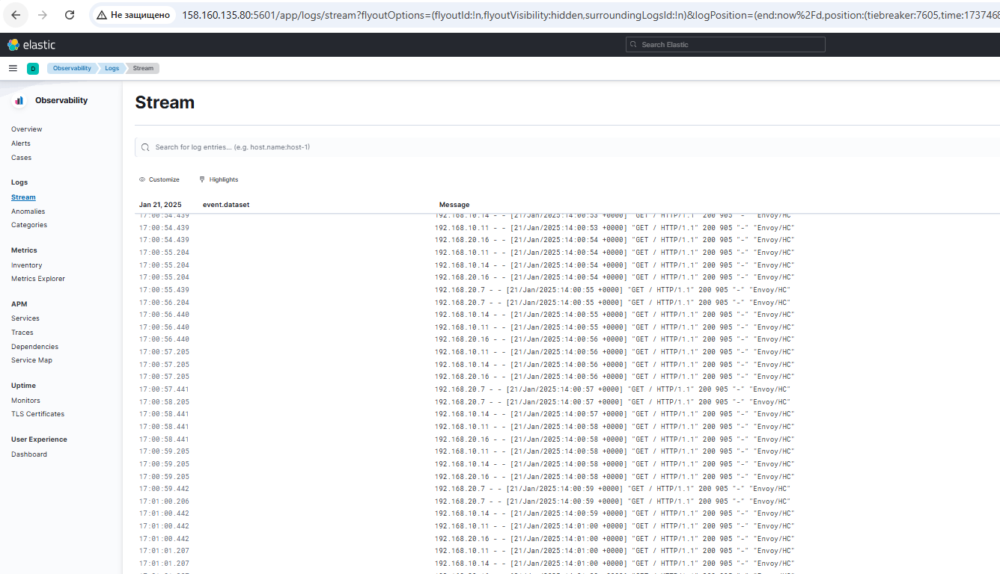
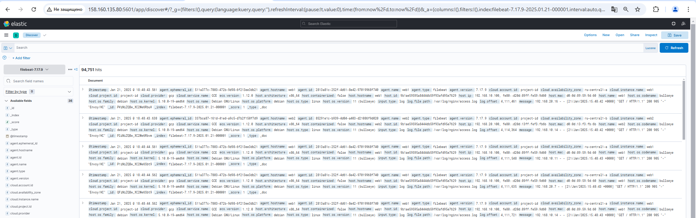

# diplom_sys-35
# Дипломная работа по профессии «Системный администратор» - Виктор Важинский 
Контакт для связи [@vikvag1](https://t.me/vikvag1)
---------

## Задача
Ключевая задача — разработать отказоустойчивую инфраструктуру для сайта, включающую мониторинг, сбор логов и резервное копирование основных данных. Инфраструктура должна размещаться в [Yandex Cloud](https://cloud.yandex.com/) и отвечать минимальным стандартам безопасности: запрещается выкладывать токен от облака в git. Используйте [инструкцию](https://cloud.yandex.ru/docs/tutorials/infrastructure-management/terraform-quickstart#get-credentials).

# Terraform

Для начала создаём общую сеть:
```
resource "yandex_vpc_network" "network-main" {
  name        = "network-main"
  description = "Общая сеть"
}
```
Создаём подсети для размещения серверов:
```
esource "yandex_vpc_subnet" "subnet-vm1" {
  name           = "subnet-web1"
  description    = "Подсеть ВМ vm1"
  zone           = "ru-central1-a"
  v4_cidr_blocks = ["192.168.10.0/24"]
  network_id     = yandex_vpc_network.network-main.id
  route_table_id = yandex_vpc_route_table.route_table.id
}
resource "yandex_vpc_subnet" "subnet-vm2" {
  name           = "subnet-web2"
  description    = "Подсеть ВМ vm2"
  zone           = "ru-central1-b"
  v4_cidr_blocks = ["192.168.20.0/24"]
  network_id     = yandex_vpc_network.network-main.id
  route_table_id = yandex_vpc_route_table.route_table.id
}
resource "yandex_vpc_subnet" "subnet-inside" {
  name           = "subnet-inside"
  description    = "Подсеть балансировщика"
  zone           = "ru-central1-d"
  v4_cidr_blocks = ["192.168.30.0/24"]
  network_id     = yandex_vpc_network.network-main.id
  route_table_id = yandex_vpc_route_table.route_table.id
}

resource "yandex_vpc_subnet" "subnet-bastion" {
  name           = "subnet-bastion"
  description    = "Подсеть ВМ bastion"
  zone           = "ru-central1-d"
  v4_cidr_blocks = ["192.168.40.0/24"]
  network_id     = yandex_vpc_network.network-main.id
  
}
```
![alt text] (./img/karta.png)

Описываем в конфигурационном файле параметры ресурсов виртуальных машин, которые необходимо создать:
```
resource "yandex_compute_instance" "vm1" {
  name                      = "web1"
  hostname                  = "web1"
  platform_id               = "standard-v3"
  zone                      = "ru-central1-a"
  allow_stopping_for_update = true
  
  resources {
    core_fraction = 20
    cores         = 2
    memory        = 2
  }
  boot_disk {
    initialize_params {
      image_id = "fd8o41nbel1uqngk0op2"
      size     = 10
    }
  }

  scheduling_policy {
    preemptible = true
  }

  network_interface {
    subnet_id          = yandex_vpc_subnet.subnet-vm1.id
    security_group_ids = [yandex_vpc_security_group.inside.id]
    ip_address         = "192.168.10.100"
  }
  metadata = {
    user-data = "${file("./metadata.yaml")}"
  }
}

```
yandex_compute_instance — описание ВМ:
- name — имя ВМ.
- allow_stopping_for_update — разрешение на остановку работы виртуальной машины для внесения изменений.
- platform_id — платформа.
- zone — зона доступности, в которой будет находиться ВМ.
- resources — количество ядер vCPU и объем RAM, доступные ВМ. Значения должны соответствовать выбранной платформе.
- boot_disk — настройки загрузочного диска. Укажите идентификатор диска.
- network_interface — настройка сети. 
- metadata — в метаданных необходимо передать открытый SSH-ключ для доступа на ВМ.
- yandex_vpc_network — описание облачной сети.
- yandex_vpc_subnet — описание подсети, к которой будет подключена ВМ.

Остальные машины выполняются по образу и подобию первой.

Создаём Target Group, включаем в неё две созданных ВМ.
```
resource "yandex_alb_target_group" "target-group" {
  name = "target-group"

  target {
    subnet_id  = yandex_compute_instance.vm1.network_interface.0.subnet_id
    ip_address = yandex_compute_instance.vm1.network_interface.0.ip_address
  }
  target {
    subnet_id  = yandex_compute_instance.vm2.network_interface.0.subnet_id
    ip_address = yandex_compute_instance.vm2.network_interface.0.ip_address
  }
}
```


Создаём Backend Group, настройте backends на target group, ранее созданную, настройте healthcheck на корень (/) и порт 80, протокол HTTP.:

```
esource "yandex_alb_backend_group" "backend-group" {
  name = "backend-group"
  http_backend {
    name             = "backend"
    weight           = 1
    port             = 80
    target_group_ids = [yandex_alb_target_group.target-group.id]
    
    load_balancing_config {
      panic_threshold = 9
    }
    
    healthcheck {
      healthcheck_port    = 80
      timeout             = "5s"
      interval            = "2s"
      healthy_threshold   = 2
      unhealthy_threshold = 15
      http_healthcheck {
        path = "/"
      }
    }
  }
}
```
Создаём HTTP router. Путь указываем — /, backend group — созданную ранее.
```
resource "yandex_alb_http_router" "http-router" {
  name = "http-router"
}

resource "yandex_alb_virtual_host" "virtual-host" {
  name           = "virtual-host"
  http_router_id = yandex_alb_http_router.http-router.id
  route {
    name = "route"
    http_route {
      http_match {
        path {
          prefix = "/"
        }
      }
      http_route_action {
        backend_group_id = yandex_alb_backend_group.backend-group.id
        timeout          = "3s"
      }
    }
  }
}
```
Создаём Application load balancer для распределения трафика на веб-сервера, созданные ранее. Указываем HTTP router, созданный ранее, задайте listener тип auto, порт 80.
```
resource "yandex_alb_load_balancer" "load-balancer" {
  name               = "load-balancer"
  network_id         = yandex_vpc_network.network-main.id
  security_group_ids = [yandex_vpc_security_group.inside.id, yandex_vpc_security_group.balancer.id]
  
  allocation_policy {
    
    location {
      zone_id   = "ru-central1-a"
      subnet_id = yandex_vpc_subnet.subnet-vm1.id
    }
    
    location {
      zone_id   = "ru-central1-b"
      subnet_id = yandex_vpc_subnet.subnet-vm2.id
    }

  }


  listener {
    name = "listener"
    endpoint {
      address {
        external_ipv4_address {
          address = yandex_vpc_address.address.external_ipv4_address[0].address
        }
      }
      ports = [80]
    }
    http {
      handler {
        http_router_id = yandex_alb_http_router.http-router.id
      }
    }
  }
}

```
Ansible
подключаемся по ssh  к серверу "bastion--host", и устанавливаем на него Ansible.

```
$ sudo apt install wget gpg

$ UBUNTU_CODENAME=focal

$ wget -O- "https://keyserver.ubuntu.com/pks/lookup?fingerprint=on&op=get&search=0x6125E2A8C77F2818FB7BD15B93C4A3FD7BB9C367" | sudo gpg --dearmour -o /usr/share/keyrings/ansible-archive-keyring.gpg

$ echo "deb [signed-by=/usr/share/keyrings/ansible-archive-keyring.gpg] http://ppa.launchpad.net/ansible/ansible/ubuntu $UBUNTU_CODENAME main" | sudo tee /etc/apt/sources.list.d/ansible.list

$ sudo apt update && sudo apt install ansible
```
проверяем установку Ansible



настроим конфигурацию Ansible, config file = /etc/ansible/ansible.cfg

ansible.cfg

```
[default]
remote_user = user
inventory = /home/user/ansible/hosts
private_key_file=/home/user/.ssh/id_rsa
host_key_checking = False
collections_paths = /root/.ansible/collections/ansible_collections

[privilege_escalation]
become = True
become_method = sudo
become_user = root
```
пропишем хосты в файле inventory = /home/user/ansible/hosts

hosts

```
[all]
web1.ru-central1.internal
web2.ru-central1.internal
bastion-host.ru-central1.internal
zabbix.ru-central1.internal
elasticsearch.ru-central1.internal
kibana.ru-central1.internal

[web]
web1.ru-central1.internal
web2.ru-central1.internal

[kibana]
kibana.ru-central1.internal

[zabbix]
zabbix.ru-central1.internal

[elastic]
elasticsearch.ru-central1.internal

[all:vars]
ansible_ssh_user=user
ansible_ssh_private_key_file=/home/user/.ssh/id_rsa

```
проверяем доступность серверов
```
$ ansible -m ping all -i hosts
```


на виртуальные машины web1 и web2 установим NGINX
```
$ ansible-playbook -i hosts nginx.yml
```


сайт доступен по адресу http://51.250.42.15/

Протестируйте сайт curl -v <публичный IP балансера>:80




устанавливаем zabbix-server

```
$ ansible-playbook -i hosts zabbix-server.yml
```

после установки zabbix-server доступен по адресу

```
http://51.250.42.15:8080
```


устанавливаем zabbix-agent на сервера

```
ansible-playbook -i hosts zabbix_agent.yml
```


после установки zabbix agenta на hosts  переходим на страницу web-интерфейса zabbix сервера и настраиваем подключения


устанавливаем elacticsearch на сервер 



устанавливаем kibana на сервер

```
ansible-playbook -i hosts kibana.yml
```


после установки kibana-server доступен по адресу

```
http://158.160.143.229:5601/
```


устанавливаем filebeats servera web1 и web2








